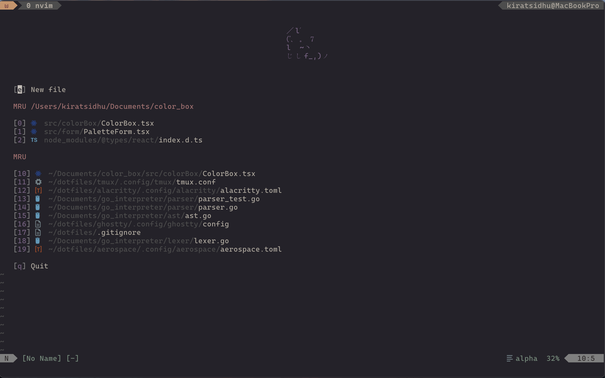

# vim-setup

Been learning vim and this is an updated setup I enjoy using.
I primarily work in typescript, react, golang. Been playing around with rust too.

## Plugins:

- [folke/lazy.nvim](https://github.com/folke/lazy.nvim) - A plugin manager for Neovim
- [eldritch/nvim](https://github.com/eldritch-theme/eldritch.nvim) - A colorscheme I like with support for lsp, treesitter and a variety of plugins
- [stevearc/conform.nvim](https://github.com/stevearc/conform.nvim) - Lightweight, powerful formatter
- [nvim-lualine/lualine.nvim](https://github.com/nvim-lualine/lualine.nvim) - A blazing fast and easy to configure Neovim statusline written in Lua
- [nvim-treesitter/nvim-treesitter](https://github.com/nvim-treesitter/nvim-treesitter) - Treesitter configurations and abstraction layer for Neovim
- [kyazdani42/nvim-web-devicons](https://github.com/nvim-tree/nvim-web-devicons) - Lua fork of vim-web-devicons for neovim
- [nvim-telescope/telescope.nvim](https://github.com/nvim-telescope/telescope.nvim) - A highly extendable fuzzy finder over lists
- [rcarriga/nvim-notify](https://github.com/rcarriga/nvim-notify) - Configurable notification manager for neovim
- [windwp/nvim-autopairs](https://github.com/windwp/nvim-autopairs) - Autopairs
- [windwp/nvim-ts-autotag](https://github.com/windwp/nvim-ts-autotag) - Use treesitter to auto close and auto rename html tag
- [lewis6991/gitsigns.nvim](https://github.com/lewis6991/gitsigns.nvim) - Git integration for buffers
- [tpope/vim-fugitive](https://github.com/tpope/vim-fugitive) - A Git wrapper for nvim
- [L3MON4D3/LuaSnip](https://github.com/L3MON4D3/LuaSnip) - Snip engine
- [hrsh7th/nvim-cmp](https://github.com/hrsh7th/nvim-cmp) - A completion engine plugin for neovim written in Lua.
- [hrsh7th/cmp-cmdline](https://github.com/hrsh7th/cmp-cmdline) - A nvim-cmp source for command line completion
- [goolord/alpha-nvim](https://github.com/goolord/alpha-nvim) - A lua powered greeter
- [mfussenegger/nvim-lint](https://github.com/mfussenegger/nvim-lint) - asynchronous linter plugin
- [karb94/neoscroll](https://github.com/karb94/neoscroll.nvim) - Smooth scrolling plugin
- [ThePrimeagen/harpoon](https://github.com/ThePrimeagen/harpoon/tree/harpoon2) - Nice approach to marking files with nice UI

## Shell Setup:

- NeoVim
- Nerd fonts - Powerline-patched fonts. I use Mononoki Nerd Font.
